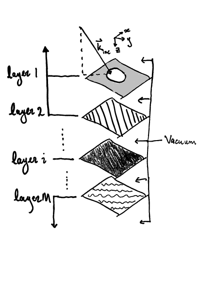

# DeltaRCWA.jl

## About

`DeltaRCWA.jl` is a frequency-domain solver for the scattering of
electromagnetic fields through stacks of periodic, variable-impedance sheets
suspended in vacuum that employs sheet-transition conditions with
[RCWA](https://en.wikipedia.org/wiki/Rigorous_coupled-wave_analysis).

This project was started by Luke Qi [in this
repository](https://github.com/Mastercheese77/deltaRCWA) and has been conducted
under the supervision of Professor Steven G. Johnson and Dr. Raphaël Pestourie.

## Device geometries

A geometry for `DeltaRCWA` represents a device composed of a stack of periodic,
variable-impedance sheets suspended in vacuum.
This can be viewed as a coarse proxy of a device composed of layered
[metasurfaces](https://en.wikipedia.org/wiki/Electromagnetic_metasurface).
An example of a valid geometry for `DeltaRCWA` is illustrated below:

The illustration shows a single unit cell, though the actual device would repeat
the unit cell infinitely in the plane of the sheet.
The colorings of the layers in the sheet represent the metasurface impedance
parameters, described below.

## Sheet transition conditions

For a sheet given by its normal vector

that separates region

from region
,
the jump in the tangential electromagnetic fields at the
surface of the sheet in each region is modeled by [1]:

 

where

is the electrical impedance matrix and

is the magnetic conductance matrix defined at each point in the sheet.
These equations and Maxwell's equations are used to derive a scattering matrix
for the sheet in the planewave basis.

## Redheffer star product

[Redheffer's star product](https://en.wikipedia.org/wiki/Redheffer_star_product)
is used to combine the scattering matrices generated for each layer of the device into one describing the whole device.
Then the scattering matrix multiplies the incident mode amplitudes to obtain the
scattered mode amplitudes.

## Contents

- `notebooks`: interactive Pluto and Jupyter notebooks showcasing the uses of
`DeltaRCWA` as well as doing exploratory tests/debugging which will hopefully
be ready to include in `DeltaRCWA`
- `src`: the source code of `DeltaRCWA`
- `scripts`: contains Julia scripts to do convergence and validation tests
for different solution methods
- `test`: contains unit tests of `DeltaRCWA`'s star product methods

The root folder and `notebooks`, `scripts`, and `test` each contain a separate
Julia environment. See `notebooks/README.md` for an example on how to set one up.

## Documentation

Currently the documentation is informal at its best.
An attempt has been made to provide docstrings for most types and functions.
To see an example usage, open the Pluto notebook in `notebooks/interface.jl`.

## Tests

This is todo and not to be done until more of the package is working.

## References

- [1] [E. Kuester, M. Mohamed, M. Piket-May, and C. Holloway,
    “Averaged transition conditions for electromagnetic fields at a metafilm,”
    _IEEE Trans. Antennas Propag._, vol. 51, no. 10, pp. 2641–2651, Oct. 2003.](
    https://doi.org/10.1109/TAP.2003.817560)